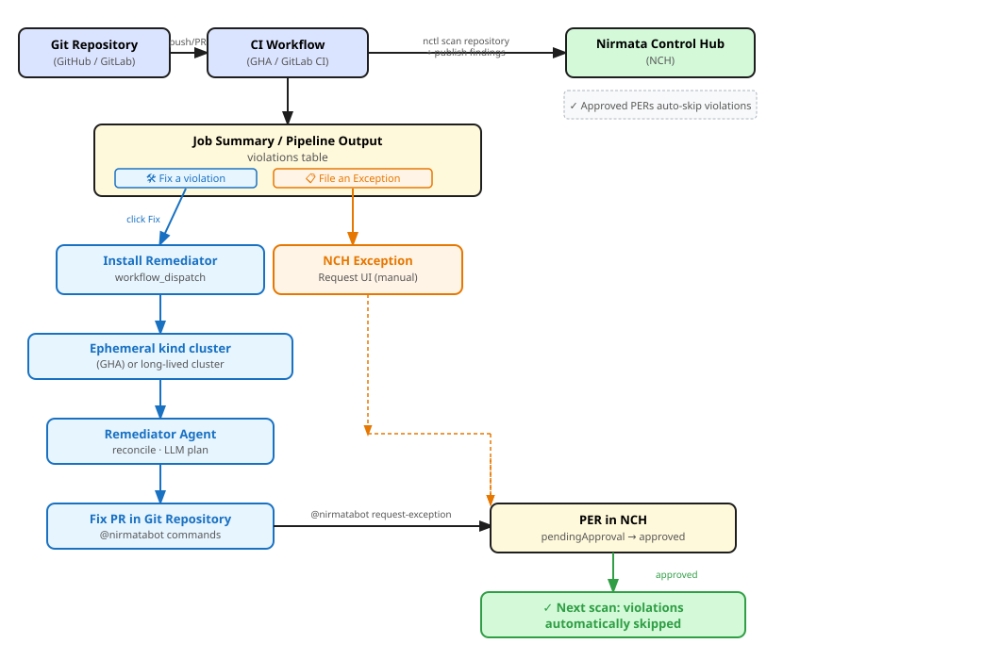
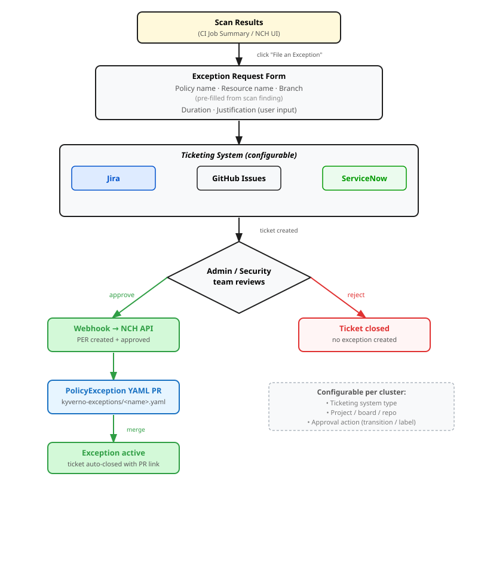

# Helm Chart Pipeline Scanning Guide

This guide covers automated Kyverno policy scanning for Helm chart repositories using the
[Nirmata Control Hub (NCH)](https://nirmata.io) pipeline scanning integration. It applies to
**GitHub Actions** and **GitLab CI** repositories.

For setup instructions, see the [repository README](../README.md).

---

## 1. Overview

### What it does

The pipeline scanning integration:

1. Scans your Helm chart repository for Kyverno policy violations using `nctl scan repository`
2. Publishes scan findings to NCH for tracking and exception management
3. Displays violations in the CI job summary with one-click actions:
   - **🛠️ Fix a violation** — triggers the Remediator Agent to open an automated fix PR
   - **📋 File an Exception** — navigates to the NCH findings page to request a policy exception
4. On fix PRs, `@nirmatabot` commands let developers split PRs or request exceptions without leaving the PR review

### How `nctl scan repository` handles Helm charts

`nctl scan repository` detects Helm charts in the scanned path and processes them natively —
no separate `helm template` step is needed. Violations are reported against the chart's resources
as they would be deployed.

When the Remediator Agent creates a fix PR, it uses **HelmMapper** to trace each violation back
to the Helm chart source file (template or `values.yaml`) so the patch is applied to the correct
location in your chart rather than to any rendered output.

### Architecture



> **Note (2a — NCH UI path):** Approved PERs suppress violations automatically on the next scan run — no YAML file is needed in the repository.
>
> **Note (2b — nirmatabot path):** A `PolicyException` YAML must be created and merged in the repository before violations are suppressed. Automatic creation of this YAML PR after PER approval is blocked by open issues [#417](https://github.com/nirmata/go-service-agent/issues/417) and [#418](https://github.com/nirmata/go-service-agent/issues/418).

---

## 2. PolicyException Workflow

A PolicyException tells Kyverno to skip a specific policy check for a named resource. There are two
ways to create one: through the NCH UI, or through `@nirmatabot` commands on a remediation PR.

---

### 2a. Creating Exceptions via the NCH UI

Use this path for ad-hoc exceptions, bulk management, or exceptions not tied to a fix PR.

**Steps:**

1. In NCH, go to **Policies → Exception Requests → New Exception Request**
2. Fill in the form:
   - **Policy name** — the Kyverno policy to exempt (e.g. `restrict-seccomp-strict`)
   - **Branch scope** — a specific branch (e.g. `helm-app`) or **all branches**
   - **TTL** — duration (e.g. `30d`, `90d`) or `permanent`
   - **Justification** — reason for the exception
3. Submit — the PER enters `pendingApproval` state
4. An approver receives an email notification and reviews the request in NCH
5. On approval, NCH records the exception. The next scan run against this repository
   automatically skips violations covered by the approved exception — no YAML file needs
   to be committed to the repository

**Limitations:**

| Limitation | Detail |
|---|---|
| Branch-only scoping | Exceptions can only be scoped to a specific branch or all branches. **Resource kind, name, and namespace cannot be selected.** The exception applies to every resource that triggers the policy on the scoped branch. |
| No link to CI findings | Exceptions created via UI are not linked to a specific scan run or fix PR |
| TTL management is manual | Renewal and revoke must be done manually via NCH UI |

---

### 2b. Creating Exceptions via Nirmatabot (Remediation PRs)

Use this path when reviewing a fix PR and deciding a fix is not feasible or not desired.

**When it's available:** The nirmatabot window is open for **20 minutes** after the fix PR is
created. Post your command as a comment on the PR within that window.

**Commands:**

```
@nirmatabot request-exception <policy-name>
@nirmatabot request-exception <policy-name> duration=30d reason="Upstream fix pending in v2.1"
@nirmatabot request-exception <policy-name> duration=permanent reason="Third-party chart, no control over spec"
```

**What happens:**

1. Nirmatabot parses the comment and identifies the matching violation in the fix PR
2. The agent creates a `PolicyExceptionRequest` (PER) in NCH scoped to the specific policy and
   affected resources
3. A confirmation comment is posted on the PR with a direct link to the PER in NCH
4. The PER enters `pendingApproval` state — an approver reviews it in NCH
5. _(Pending [#418](#open-issues))_ Once approved, the agent should automatically open a PR in
   this repository with the generated `PolicyException` YAML at `kyverno-exceptions/<name>.yaml`
6. Merge that PR — subsequent scan runs will then skip the violations covered by the exception

**GitHub vs GitLab:** The same command syntax works for both. GitHub triggers via the PR comment
webhook; GitLab uses the GitLab comment event webhook.

**Splitting a multi-policy PR:**

If the fix PR covers multiple policies and you want separate PRs:

```
@nirmatabot split-pr disallow-privilege-escalation require-run-as-nonroot
```

This creates one new PR per named policy, each containing only the fixes for that policy. Useful
when different policies have different approvers or urgency.

#### Open Issues

| Issue | Description | Status |
|---|---|---|
| [#417](https://github.com/nirmata/go-service-agent/issues/417) | PER created via nirmatabot shows "All Violations" scope in NCH instead of the specific requested policy | Fix in PR [#415](https://github.com/nirmata/go-service-agent/pull/415) — pending merge |
| [#418](https://github.com/nirmata/go-service-agent/issues/418) | No `PolicyException` YAML PR is created in the repository after the PER is approved in NCH | Design options in draft PR [#419](https://github.com/nirmata/go-service-agent/pull/419) — pending dev team decision |

**Workaround for #418:** After approving a PER in NCH, manually download the `PolicyExceptionSpec.yaml` (**Exception Requests → [PER name] → Download YAML**), commit it to `kyverno-exceptions/<per-name>.yaml` in your repository, open a PR, and merge it. Subsequent scans will then skip the covered violations.

---

## 3. Enhancements

### Proposed: Ticketing System Integration for Exception Requests

**Motivation:** Today there is no structured approval trail when a developer requests a policy
exception from a scan finding. Exceptions flow through NCH but are disconnected from standard
engineering ticketing systems (Jira, GitHub Issues, ServiceNow) that security and compliance teams
already use for approval workflows.

**Proposed flow:**

When a developer clicks **📋 File an Exception** in the CI job summary, an exception request form
opens pre-filled with the policy name, resource name, and branch from the scan finding. On submit,
a ticket is automatically created in the configured ticketing system. When the ticket is approved
by the security team, a webhook triggers NCH to create and approve the PER, which then generates
the `PolicyException` YAML PR in the repository.



**Integration points:**

| Component | Proposed behavior |
|---|---|
| "File an Exception" button | Opens a form pre-filled from the scan finding; on submit, creates a ticket in the configured system |
| Ticket body | Includes policy name, rule, resource kind/name/namespace, branch, link to NCH finding |
| Ticket approval action | Configurable: Jira transition, GitHub label (e.g. `exception-approved`), ServiceNow approval |
| Webhook → NCH | On ticket approval, NCH API call creates and approves the PER |
| Auto-skip on next scan | Once the PER is approved, the next scan run automatically skips matching violations |
| Ticket auto-close | After the next clean scan, the ticket is updated with the result and closed |

**Supported ticketing systems (proposed):**

- **Jira** — project key + approval transition name configured in NCH cluster settings
- **GitHub Issues** — repository + approval label configured in NCH cluster settings
- **ServiceNow** — service catalog item + approval group

**Configuration:** Ticketing system type, project/board, and approval action are set per cluster or
per policy group in NCH settings. No per-repository configuration is needed.

---
